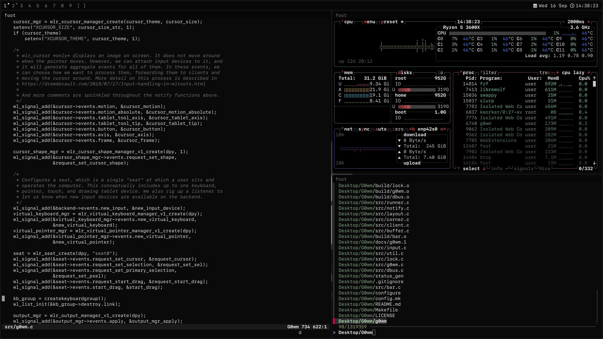
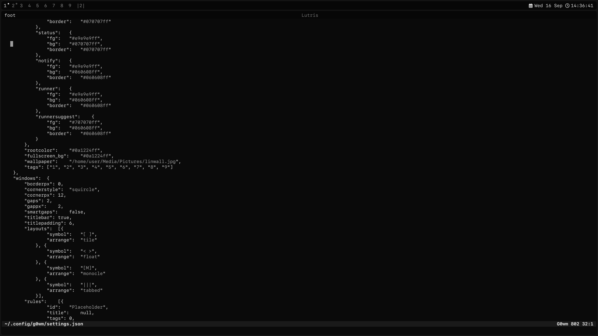

<div align="center">

# G0wm

**A personal desktop environment designed to my liking**

[](https://en.wikipedia.org/wiki/C_(programming_language))

[](LICENSE)

</div>

## What this is

This is my own build of [dwl], kept here so I can pull it onto whatever machine
I happen to be using. It started as a fork and has changed quite a bit since
then. It is not meant to replace dwl or to pass itself off as a separate
project.

The original dwl is a minimal Wayland compositor that relies on external
programs for things like the bar, notifications and the application launcher.
g0wm handles all of these directly, which makes it closer to a small desktop
environment than to a plain compositor.

A tour of what all of this looks like in use is in
[docs/features.md](docs/features.md), the settings are documented in the
comments of [`include/config.h`](include/config.h), and the man page is at
[`docs/g0wm.1`](docs/g0wm.1).

## Screenshots

<table align="center">
<tr>
<td align="center"><b>Windowed</b></td>
<td align="center"><b>Tabbed</b></td>
</tr>
<tr>
<td></td>
<td></td>
</tr>
</table>

## Build

The required dependencies are `wlroots` 0.20 with the libinput backend,
`wayland`, `wayland-protocols`, `libinput`, `xkbcommon`, `pixman`, `fcft`,
`libdbus` and `pkg-config`.

X11 support also requires `libxcb`, `libxcb-icccm` and `Xwayland`.

`gdk-pixbuf` is only needed if you want to use the built in wallpaper support.

```sh
./configure && make
make install      # g0wm, start-g0wm and g0wm-status.sh into ~/.local/bin
```

You can also just run `make`. It will use `config.def.mk` if no custom
configuration exists yet.

Some features can be disabled during the build:

| Flag | Disables |
| --- | --- |
| `--disable-xwayland` | X11 support (`libxcb`) |
| `--no-systray` | the tray in the bar |
| `--no-notify` | the notification server |
| `--no-runner` | the bar runner, `MODKEY+r` starts `menucmd` instead |
| `--no-titlebar` | the per-window title bars and the tabs drawn in them |
| `--no-integrated-background` | the wallpaper renderer (`gdk-pixbuf`) |

Run `./configure --help` to see the other available options such as
toolchain settings, `--debug` and `--native`.

## Configure

Every setting lives in `~/.config/g0wm/settings.json`, which `make install`
writes and g0wm reads at startup. Only the sections the build was configured
with go in it: a `--no-systray` build has no tray settings.

```sh
g0wm -c             # write it if it is not there, then print what g0wm reads
```

An existing file is never overwritten. Startup checks it and reports anything
missing, mistyped or unknown, and keeps the built-in value for it.

[`include/config.h`](include/config.h) holds those built-in values, divided
into numbered sections; it is what a fresh `settings.json` is written from, so
read the header at the top of it before changing anything. Edit it by hand:
changing it needs a rebuild, and a `settings.json` that is already there wins
over it.

The status text shown in the bar comes from `scripts/g0wm-status.sh`. Its
configuration is stored in `~/.config/g0wm/status.conf`.

You can generate it with:

```sh
./status_gen        # choose the modules, order and format
```

`status_gen` creates a backup before replacing an existing file.

The available modules are listed in the status text section of
[docs/features.md](docs/features.md), and `status.conf` documents its own
formats in the comments `./status_gen` writes into it.

## Run

Run `start-g0wm` from a VT.

It sets up the session environment, starts PipeWire, runs the status script
and stores logs in `~/.local/state/g0wm/`.

The file `share/g0wm.desktop` can be used as a session entry for display
managers. It is not installed automatically by `make install`.

The desktop entry starts g0wm directly instead of using `start-g0wm`. If you
want to use it, copy it to `/usr/share/wayland-sessions/` and set `Exec` to
whichever startup method you prefer.

## License

g0wm is licensed under **GPL-3.0-or-later**.

The full license text is available in [`LICENSE`](LICENSE).

Some parts of the project come from dwl and from other projects and keep their
original licenses. Their license files are stored in the `license/` directory.

Where each part comes from, the patch authors and the great thanks they are
owed are collected in [docs/credits.md](docs/credits.md).

[dwl]: https://codeberg.org/dwl/dwl
[dwl-patches]: https://codeberg.org/dwl/dwl-patches
[systray]: https://codeberg.org/dwl/dwl-patches/src/branch/main/patches/bar-systray
[dwm]: https://dwm.suckless.org/
[sway]: https://github.com/swaywm/sway
[wlroots]: https://gitlab.freedesktop.org/wlroots
