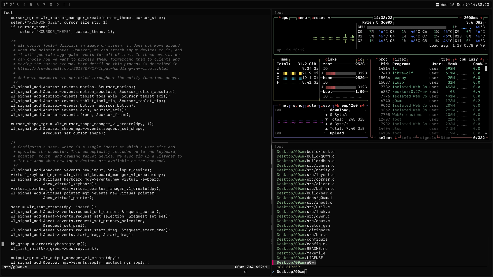
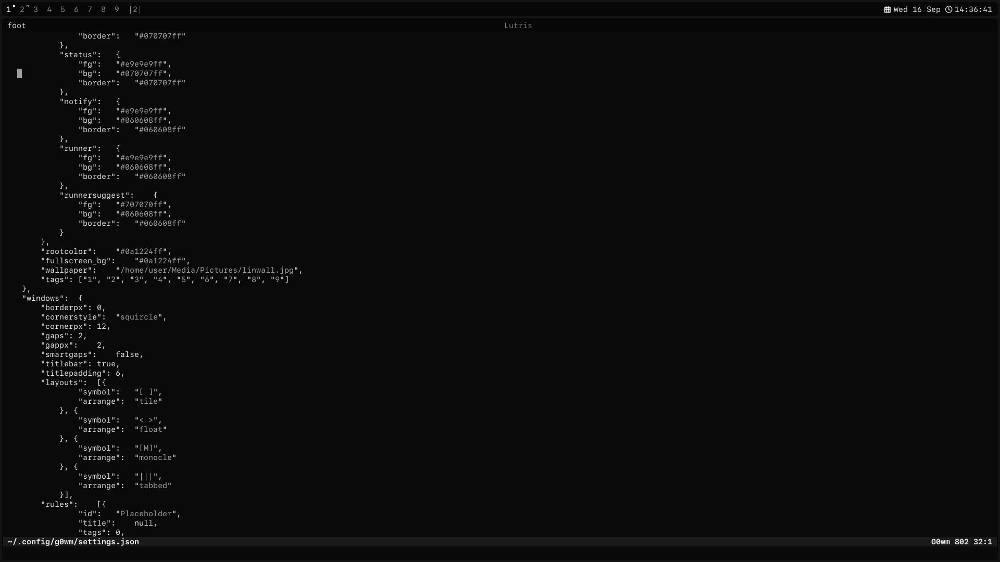

<div align="center">

# G0wm

**A personal desktop environment designed to my liking**

[](https://en.wikipedia.org/wiki/C_(programming_language))

[](LICENSE)

</div>

## What this is

g0wm is a minimal Wayland compositor built on dwl and reworked from the ground
up. It is designed to feel more like a complete desktop environment.
Its status bar includes features such as notifications, a runner, a calculator,
and a customizable status bar. It also includes the tabbed mode from i3,
with window titles and close buttons that appear on the right side of the bar
when hovered.

The settings are documented in the comments of
[`include/config.h`](include/config.h), and the man page is at
[`docs/g0wm.1`](docs/g0wm.1).

## Screenshots

<table align="center">
<tr>
<td align="center"><b>Windowed</b></td>
<td align="center"><b>Tabbed</b></td>
</tr>
<tr>
<td></td>
<td></td>
</tr>
</table>

## Build

The required dependencies are: wlroots 0.20 (with the libinput backend),
wayland, wayland-protocols, libinput, xkbcommon, pixman, fcft,
libdbus, gdk-pixbuf and pkg-config.

X11 support also requires: libxcb, libxcb-icccm and Xwayland.

```sh
./configure && make
make install         # g0wm into ~/.local/bin
```

Run `./configure --help` to see the other available options such as
toolchain settings, `--debug` and `--native`.

## Configure & Run

Every setting lives in `~/.config/g0wm/settings.json`, which `make install`
writes and g0wm reads at startup. 

```sh
g0wm -c             # write it if it is not there
```

The status text shown in the bar is read from standard input, one line at a
time. No status script ships with g0wm.

To run G0wm `share/g0wm.desktop` to `/usr/share/wayland-sessions/` and pick g0wm in
your display manager, or run `g0wm` from a VT.

## License

g0wm is licensed under **GPL-3.0-or-later**.

The full license text is available in [`LICENSE`](LICENSE).

Some parts of the project come from dwl and from other projects and keep their
original licenses. Their license files are stored in the `license/` directory.

Where each part comes from, the patch authors and the great thanks they are
owed are collected in [docs/credits.md](docs/credits.md).

[dwl]: https://codeberg.org/dwl/dwl
[dwl-patches]: https://codeberg.org/dwl/dwl-patches
[systray]: https://codeberg.org/dwl/dwl-patches/src/branch/main/patches/bar-systray
[dwm]: https://dwm.suckless.org/
[sway]: https://github.com/swaywm/sway
[wlroots]: https://gitlab.freedesktop.org/wlroots
